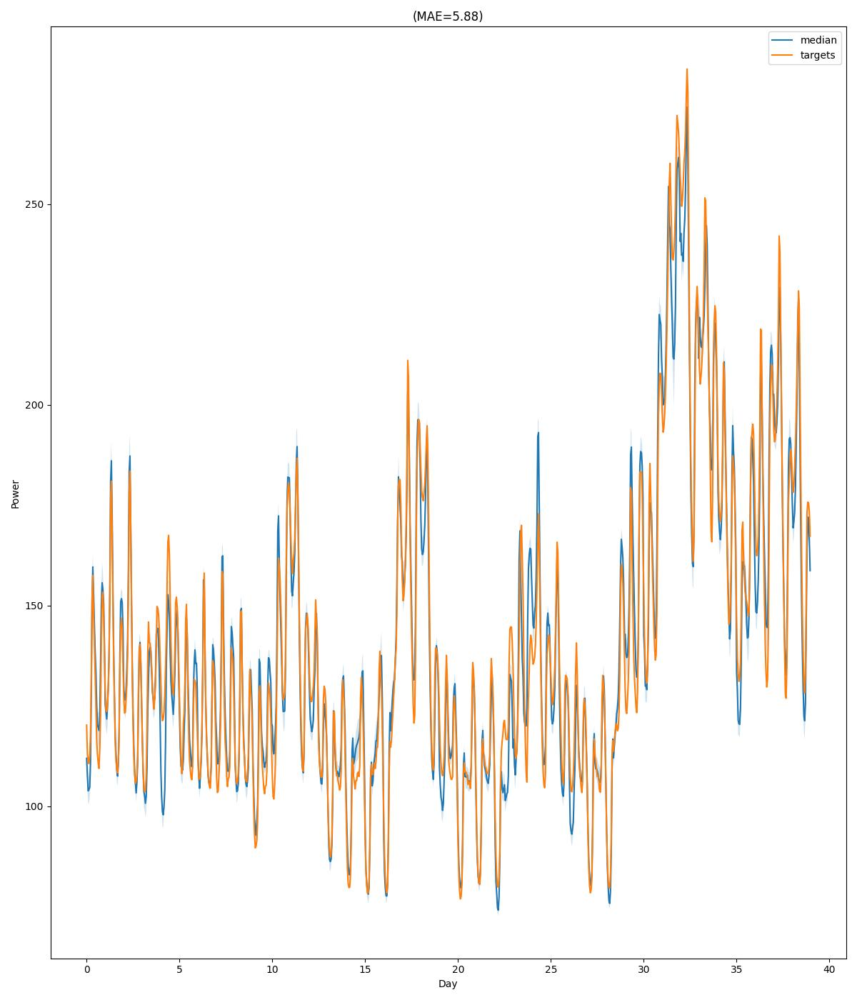

# Probabilistic Energy Forecasting

This repository demonstrates **probabilistic forecasting** in the energy domain (load, wind, solar), using **deep generative models** and **statistical evaluation**.

---

## Business Problem

Power system operators, utilities, and energy market participants must make **high-stakes operational and financial decisions under uncertainty**. Electricity demand (load) and renewable generation (wind and solar) are inherently stochastic due to weather variability, human behavior, and forecasting errors. Traditional point forecasts fail to quantify this uncertainty, leading to suboptimal or risky decisions.

Key challenges include:

- **Operational reliability**
Inaccurate uncertainty estimates can cause reserve under- or over-procurement, increasing the risk of blackouts or unnecessary operational costs.

- **Market efficiency**
Energy trading, bidding strategies, and price formation depend on understanding the full distribution of future supply and demand, not just expected values.

- **Renewable integration**
High penetration of wind and solar introduces non-Gaussian, time-varying uncertainty that classical statistical models struggle to capture.

- **Risk-aware decision making**
System operators require probabilistic forecasts to evaluate tail risks, comply with reliability standards, and support stochastic optimization.

The objective of this project is to **generate accurate, well-calibrated probabilistic forecasts** for load, wind, and solar power.

---

## What This Project Shows

- End‑to‑end ML pipeline: **data → models → tuning → training → evaluation**
- Advanced probabilistic models:
  - Conditional **WGAN‑GP**
  - Conditional **VAE**
  - **Normalizing Flows** (NAF, NSF)
- Hyperparameter optimization with **Optuna**
- Scenario‑based probabilistic forecasting
- Proper scoring rules (CRPS, Energy, Variogram)
- Statistical significance testing (Diebold–Mariano)

---

## Repository Structure

```
data/        → dataset construction & loaders
models/      → GAN / VAE / Normalizing Flow implementations
tuning/      → Optuna hyperparameter optimization
evaluation/  → probabilistic metrics & statistical tests
tests/       → unit tests for probabilistic APIs
examples/    → exploratory notebooks
*.py         → experiment orchestration scripts
```

---


## How to Run

```bash
# 1. Hyperparameter tuning (required)
python tuning/load_tuning.py
python tuning/wind_tuning.py
python tuning/solar_tuning.py

# 2. Model training & evaluation
python load_models.py
python wind_models.py
python solar_models.py
```

Outputs include trained models, probabilistic forecasts, and evaluation plots.

## Results

Below are representative results for probabilistic load, wind, and solar
forecasting. All models are evaluated using proper scoring rules and
statistical tests.

### Probabilistic Forecast Example



The figure shows the median forecast and central prediction intervals
generated by a Normalizing Flow model for the load dataset.

### Model Comparison (CRPS)


Normalizing Flow models consistently outperform GAN and VAE baselines
across all datasets.